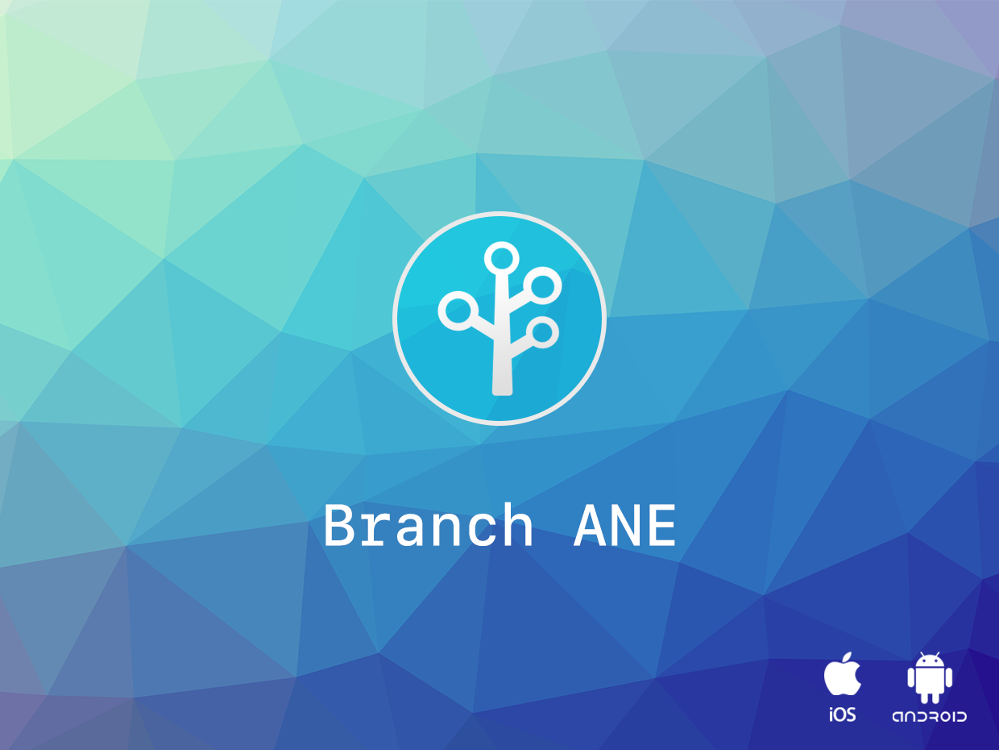

# Branch

Branch IO Adobe AIR Native Extension for iOS and Android gives you access to the [Branch](https://branch.io/) SDK in your Adobe AIR application.

[Branch](https://branch.io/) provides powerful links and solutions that help you acquire, engage, and measure across all devices, channels, and platforms.

>
> ### Deep Links
>
> Bring users to the correct page in your app even through install.
>
> Deep links point directly to your in-app content from sources across channels and platforms, delivering a high quality user experience. Our deep links go a step further, linking fresh users from install directly to the correct pages. Our links also handle every edge case, routing through every channel, platform, OS, and deep linking standard that exists.
>
>
> ### Attribution and Analytics
> 
> Capture every customer touch point across any platform, any channel, and every OS.
>
> Say goodbye to mobile fragmentation across web and app channels, and the wasted spend that results. Branch weaves it back together, providing an enhanced understanding of your users that leads to clearer, more accurate attribution and measurement.
>
>
> ### Seamless Integrations
>
> The missing piece of your marketing stack.
>
> Branch integrates into all of your marketing tools, from media execution and marketing automation to data warehouses and analytics. With a one-time sync of the Branch platform and your organic and paid channels, all of your data will be sent where you want it to go.
>
>
> [More information on the Branch website](https://branch.io/)

### Features:

- Session management 
- Link parameters 
- Credits
- Event Tracking (standard and custom)

The [Wiki](https://github.com/distriqt/ANE-BranchIO/wiki) forms the best source of detailed documentation for the extension along with the [asdocs](https://distriqt.github.io/ANE-BranchIO/asdocs). 

